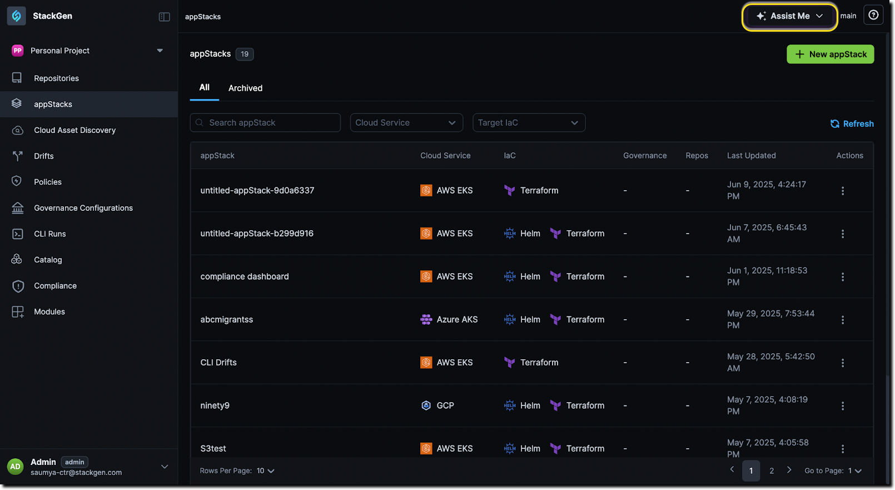
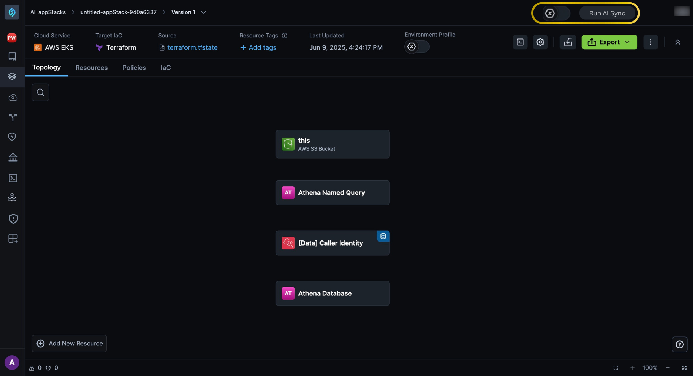
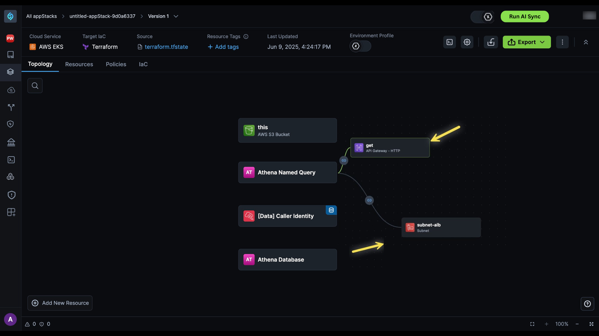

---   
description: Explain how to set up and monitor StackSync AI Connector in StackBuilder. 

title: StackSync AI Connector   
read_time: 4 min read   
customFields:   
ai_index: true   
audience:   
- developer  
- DevOps   
product_version: '1.0'   
sidebar_position: 1
---

# Task 1 


## Overview

**StackSync AI Connector** is a feature within the [StackGen](https://stackgen.com/platform-overview) platform that synchronizes configuration changes from **appStacks** to **cloud-to-code**. **StackSync AI Connector** detects any changes made in appStack, and if conditions are met, it automatically syncs them to the Infrastructure as Code (IaC) file. These changes are reflected using an asynchronous webhook trigger, thus eliminating the manual sync workflow.

## Set Up and Usage

Let’s see in detail how you can set up and use  **StackSync AI Connector** to synchronize any configuration changes.

###  Prerequisites

Before you start make sure following 

1. You have access to StackGen platform to manage appStacks  
2. You have an appStack created in StackGen (from any creation method: [scratch](https://docs.stackgen.com/docs/concepts/appstacks/createappstacks/fromscratch), [migrating IaC](https://docs.stackgen.com/docs/concepts/appstacks/createappstacks/migrateiac), [deployment files](https://docs.stackgen.com/docs/concepts/appstacks/createappstacks/fromdeploymentfiles), or [Cloud2Code](https://docs.stackgen.com/docs/cli-guide/cloud2code/) import)  
3. Your appStack is accessible in StackBuilder  
4. Your metadata.json file includes both required fields: ai\_index and clusters

### Enabling **StackSync AI Connector**

To enable the StackSync AI Connector follow these steps:

1. From the StackGen homepage, navigate to appStack, and locate the appStack you have [created using Cloud Discovery](https://docs.stackgen.com/docs/concepts/appstacks/createappstacks/fromdiscovery) from the search bar. Alternatively, click on [Assist me](https://docs.stackgen.com/docs/stackbuilder/#navigating-to-the-stackbuilder) and locate your appStack using StackBuilder  
  
2. Now, open your appStack to view the Topology Canvas  
3. You'll see all the resources discovered from your .tfstate file visualized in the Topology Canvas  
  
4. At the top-right  corner, you will see the **Run AI Sync** toggle button. It appears disabled by default,  It becomes active once configuration is initiated. Toggle it **ON** to enable synchronization.  
5. Now, you can add, edit, or remove resources, configure properties, and define dependencies to align with application requirements.

:::note
You cannot remove resources that were added during the base appStack creation, but you can modify their configurations.  
:::



6. StackSync requires metadata validation before syncing. Ensure your metadata.json includes both required fields:  
   ```  
   {  
     ai_index: true,  
     clusters: ["production"],  
     version: "1.0"  
   }  
   ```  
7. Once you've made changes, click on the "Run AI Sync" button.  
8. StackSync automatically detects configuration changes, validates the metadata.json file, triggers an async webhook to sync updates with the IaC state, updates definitions if valid, and reports the sync result.

## Troubleshooting

### **Error: Missing 'clusters' Field in metadata.json**

Problem: Sync fails with error: Error: Missing 'clusters' field in metadata.json  
Cause: The cluster field is required and missing from your metadata. This field specifies which infrastructure clusters should receive the synced configuration.  
Solution:

1. Open your metadata.json file  
2. Add the clusters field:
```  
   json  
   {  
     ai_index: true,  
     clusters: ["production"],  
     version: "1.0"  
   }  
```
     
3. You can specify multiple clusters: "clusters": \["production", "development"\]  
4. Save the file  
5. Click "Run AI Sync" again.

### **Error: Missing 'ai\_index' Field in metadata.json**  
Problem: Sync fails with error: Error: Missing 'ai\_index' field in metadata.json  
Cause: The ai\_index field is required and missing from your metadata. This field is required for StackGen's resource indexing system.  
Solution:

1. Open your metadata.json file  
2. Add the ai\_index field:  
```
   json  
   {  
     "ai_index": true,  
     "clusters": ["production"],  
     "version": "1.0"  
   }  
```
3. Save the file  
4. Return to Topology canvas and click "Run AI Sync"

### **Error: Sync Fails**   
Problem: Sync fails  
Cause: Your changes don't meet sync conditions, refer “What to expect section” (coming soon)  
Solution:  
Verify that resource modifications comply with your cloud infrastructure policies. Sync operation logs are not yet available in this release. For detailed debugging, contact StackGen Support.

## Try It Out 

Open your appStack in StackBuilder and test the sync workflow:

1. Navigate to your appStack in StackBuilder  
2. Make a simple, safe change to one resource (e.g., enable versioning, or update a tag)  
3. Click the "Run AI Sync" button at the top-right of the Topology Canvas  
4. Observe the Sync Status panel:  
   * In Progress: Sync is being processed  
   * Completed: Sync succeeded and your changes are synced to IaC  
   * Failed: Validation failed, you need to  check the error message for which field is missing (ai\_index or clusters)  
   * Skipped: If Sync conditions were not met, review your policies.  
       
5. If sync fails, try fixing the metadata issue (see [Troubleshooting](#troubleshooting)) and click "Run AI Sync" again  
   

For importing state files and creating appStacks, see [Cloud to Code Overview](https://docs.stackgen.com/docs/cli-guide/cloud2code/) and  [IaC from Cloud Discovery](https://docs.stackgen.com/docs/concepts/appstacks/createappstacks/fromdiscovery).

## Questions and Assumptions

### Questions

Q.1: What are the specific conditions required for sync config to occur?  
Q.2: Where exactly in StackBuilder's UI can users view sync status?  
Q.3: Can users sync if the appstack is created using other methods?  
Q.4: Can users see real-time sync progress, or only final status?  
Q.5: Can I see PRD and Wireframe/or have access to the pilot server in which this feature is currently deployed?

### Assumptions

* UI and UX assumption, such as location and functionality of “Run AI Sync” button, and the automatic appearance of pop-up errors with messages.  
* I have mentioned appStack created by all the methods are compatible.  
* I have assumed the Sync condition is documented somewhere, in the troubleshooting section it is mentioned “Your changes don't meet sync conditions, Refer “What to expect section” (coming soon)”.  
* Currently, I documented the UI-first “Try It Out” section, I might need more inputs on this.

## Author’s Note

I have created this document based on the limited input from Slack threads and mostly referring to the StackGen User Guides. From the best of my knowledge and understanding of the platform, I tried structuring the content in bullet points, a couple of screenshots, using StackGen-specific terminologies, and keeping the structure similar to StackGen docs.

Chances are that I might have misunderstood a few concepts. Therefore, I'd like this document to be scrutinized by the reviewer and get detailed feedback.

I'd love to incorporate that feedback and revamp the document.